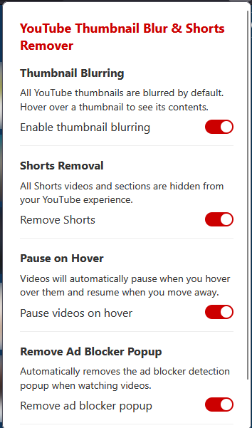
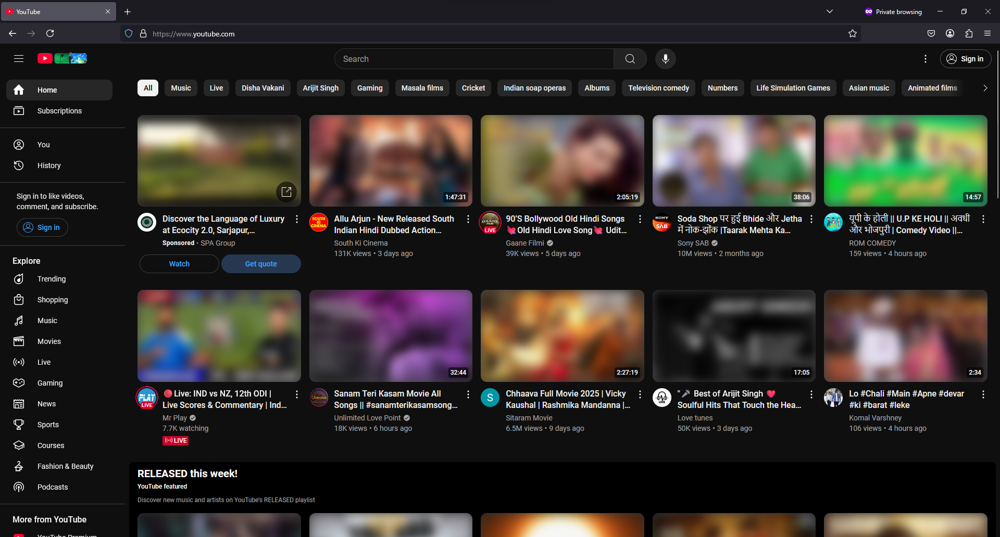
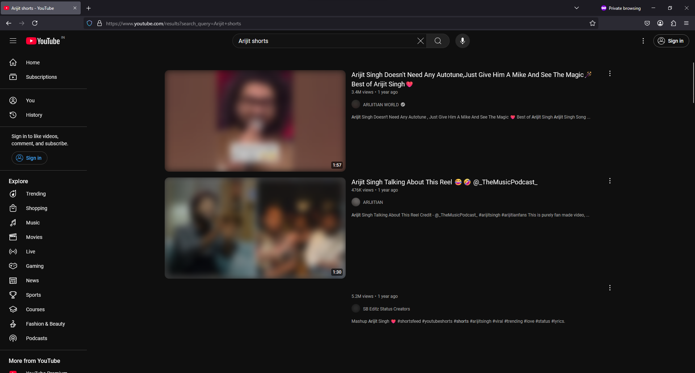
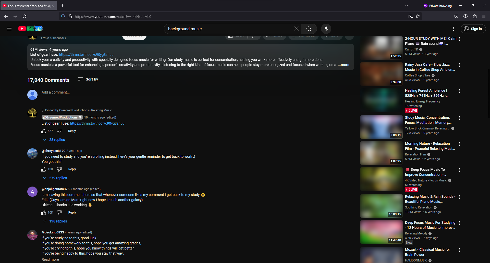
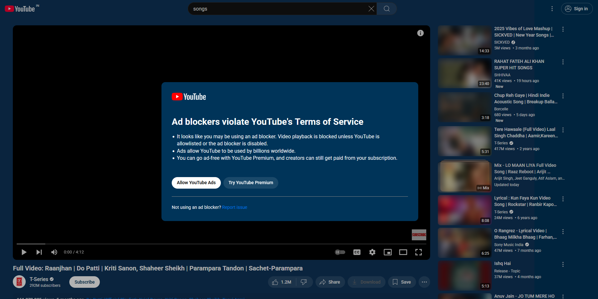

# 📺 YouTube Focus Mode: No Shorts, No Clickbait 🎯

A **Firefox extension** that helps you stay **focused** on YouTube by: 
 ✅ Blurring all video thumbnails (unblur on hover) 👀
 ✅ Removing all Shorts videos and sections 🚫
 ✅ Auto-pausing videos on hover ⏯️
 ✅ Removing ad blocker detection popups 🛡️
 ✅ **Tracking cumulative watch time** and reminding you to take breaks ⏰

---

## ✨ Features

### ⏰ Time Reminder (New!)

- **Tracks total time spent watching videos** across multiple YouTube pages/videos
- Prompts you to take a break after a configurable interval
- Helps maintain awareness of your viewing habits and encourages mindful use

### 🔍 Thumbnail Blurring

- All YouTube video thumbnails are **blurred by default**
- Hover over a thumbnail to reveal its contents 👁️
- Reduces distraction and **clickbait influence**

### 🚫 Shorts Removal

- **Removes the Shorts section** from the YouTube homepage
- **Hides the Shorts button** from the sidebar navigation
- **Filters out Shorts** from recommendations & search results

### ⏯️ Smart Video Controls

- **Auto-pause videos** when hovering over them
- **Resume playback** when moving cursor away
- Works with both main video and previews
- Perfect for **multitasking** and **bandwidth saving**

### 🛡️ Ad Blocker Protection

- **Automatically removes** ad blocker detection popups
- Ensures **uninterrupted viewing experience**
- Works silently in the background
- Toggle on/off as needed

---

## 🖼️ Screenshots

Here are some screenshots of the extension in action:

---

## 🛠️ Installation

### 🔹 Manual Installation (Developer Mode)

1. **Download or clone** this repository
2. Open **Firefox** and navigate to `about:debugging`
3. Click **"This Firefox"**
4. Click **"Load Temporary Add-on..."**
5. Select the `manifest.json` file from the downloaded repository

---

## 🎯 Usage

Once installed, the extension will automatically:

- Blur all YouTube thumbnails 🖼️
- Remove Shorts videos and sections 🚫
- Enable video pause on hover ⏯️
- Remove ad blocker popups 🛡️
- **Start tracking your cumulative watch time** ⏰

You can configure the extension by clicking on its **toolbar icon**:

- **Toggle thumbnail blurring** on/off 🎛️
- **Toggle Shorts removal** on/off 🎚️
- **Toggle video pause** on hover 🎮
- **Toggle popup removal** on/off 🛡️
- **Toggle time reminder** on/off and configure interval ⚙️

---

## 🔒 Privacy

This extension:
✅ **Does not collect any user data** 🔐
✅ **Does not communicate with any external servers** 🚫🌍
✅ **Only modifies YouTube's visual elements** 🖥️
✅ **Works completely offline** 🏠

---

## 📜 License

**MIT License**

---

Made with ❤️ to keep YouTube distraction-free! 🚀
